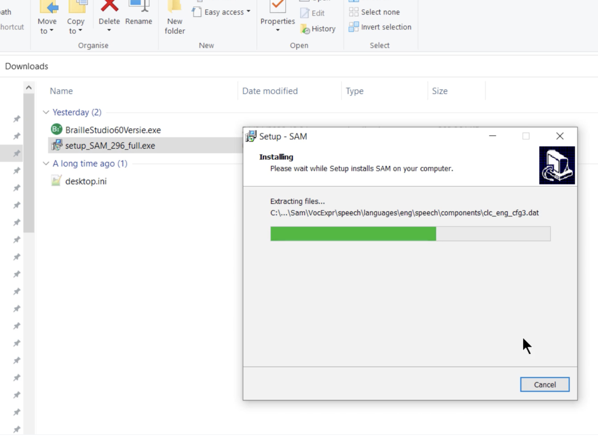
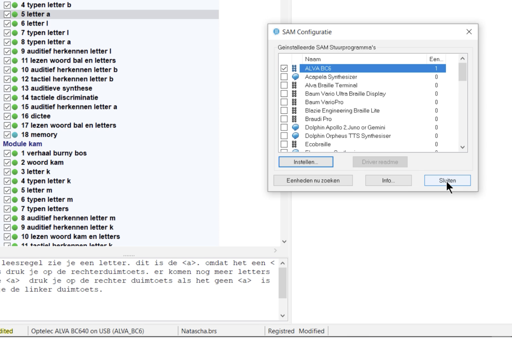
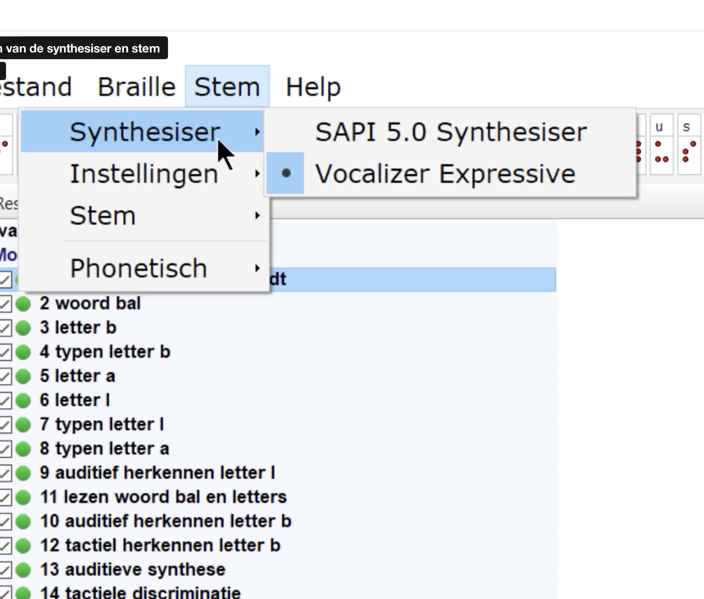

# SAM - BrailleStudio

### 1. SAM videos
Voor de koppeling van de spraakuitvoer en de brailleleesregel is het programma SAM (Synthesizer Access Manager) nodig. Als er een product van Dolphin UK wordt gebruikt zoals SuperNova, dan is de SAM al geïnstalleerd. Indien niet, dan kan deze hier worden verkregen.

https://www.eduvip.nl/braillestudio-software/downloads/setup_SAM_299_full.exe

### 2. Installatie
video [installeren](https://vimeo.com/manage/videos/410552108 ) (rel=undefined target=undefined style=undefined)

dubbelklik op het gedownloade bestand en installeer het met administrator rechten.

### 3. Instellen
video [instellen](https://vimeo.com/manage/videos/410552254) (rel=undefined target=undefined style=undefined)

### 4. Synthesizer
video [synthesizer](https://vimeo.com/manage/videos/410552185 ) (rel=undefined target=undefined style=undefined)

