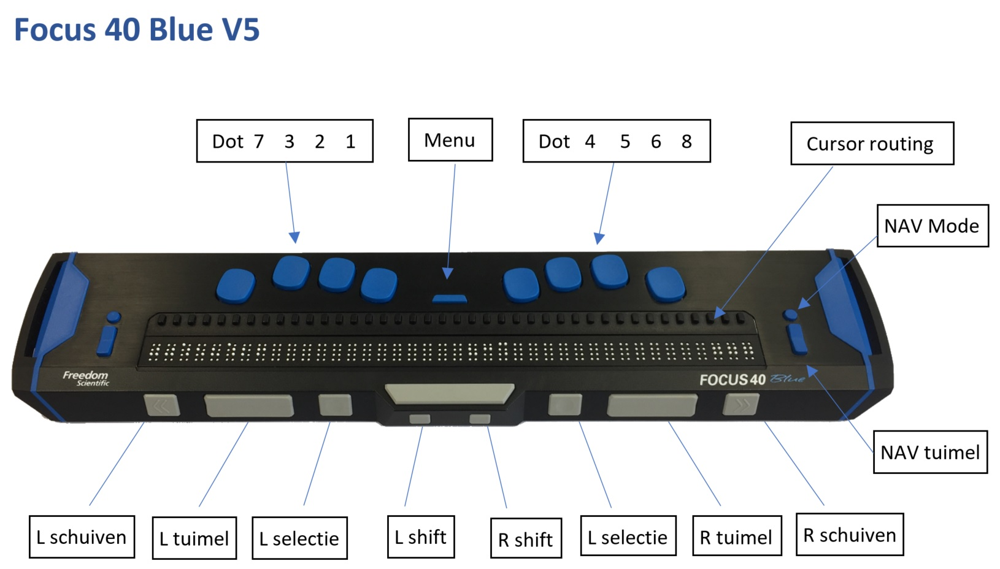

# Outlook

[outlook jaws](https://www.freedomscientific.com/webinars/microsoft-outlook-with-jaws/)
7:00 min Ilse 16:00 min Dani h6

## in outlook

| afkorting | betekenis |
|---|---|
| lst | lijst |
| og | ongelezen | 
| bl | bijlage|
| | |
| ctrl+1-8| switching tussen outlook vensters|
| 1 = |email |
| 2 = | kalender |
| 3 = | contact persoon lijst |
| 4 = | takenlijst |
| 5 = | app host |
| 6 = | knoppen menu|
| | |
| maken en zenden van een e-mail | |
| ctrl+shift+I| naar inbox|
| ctrl+shift+O| naar outbox|
| ctrl+N| nieuw mail wanneer je in je mail venster zit |
| CTRL+SHIFT+M| nieuwe mail overal anders|
| ctrl+o of enter| openen van een mail |
| ctrl+r alt+r| reageren op een bericht|
| ctrL+shift+r of alt+l|reply to all |
| alt+z| zend |
| ctrl+f| forward voorwaarden|
| F9 | zendt of ontvang alle berichten ????? |
| F4 | zoek tekst in een bericht |
| shift + F4 | verder zoeken naar zoekitem |
| | |
| maken van een email| |
| ctrl+N aan tab cc tab onderwerp tab tekstvak  | |
| bcc | |
| | |
| | |
| | |
| | |
| | |

## in de mail

| afkorting | betekenis |
|---|---|
|alt+1 (Spraak) | van afzender|
|alt+2 (Spraak)|  datum verzonden|
|alt+3|aan de geadresserden |
|alt+4 | cc |
|alt+5 | onderwerp|
| 6| bcc |
| | |
| shit+tab | ga naar de bijlage |
| alt+ pijl naar beneden | **context menu**|
| kies alle bijlagen opslaan| ok knp om alle bijlagen op te slaan |
| - shift+tab+enter | attachment openen bij 1 document |
| | |
| afkorting **tekstvak van email** | betekenis |
|---|---|
|  ctrl+home | in de tekst naar boven|
| | |
| | |
| | |
| | |
| | |
| | |
| | |
| | |

### Toetsenbord
| toets | betekenis | 
|---|---|---|
| starten | WIN outlook enter |
| enter, dubbel klik enter | email openen |
| esc | sluit de email  = terug |
| F6 (panes) - SHFT F6 (terug door panes) | lijst van emails > status balk (pijltjes) > bovenste lint uitgevouwen > lijst welke aan de linkerkant staat > favorieten koppen > terug bij lijst van emails|
| Menu | |
| ctrl+shift+i| focus io de **inbox** zetten|
| home | naar de eerste mail gaan |
| | |
| | |
| normale leescommando| |
| ins pijl omlaag | lees de tekst vanaf de cursor |

### Leesregel

| toets | betekenis | |
|---|---|---|
| NAV mode | lijst modus uit/aan, dan kun je met de NAV tuimel toetsen door de lijst heen gaan| dit is ook mogelijk met de toetsenbord pijltjes|
| RDT| verder lezen op de leesregel | aan einde staat 2 van 6 |

### Acties
| Actie | betekenis | |
|---|---|---|
| bijlage(n) opslaan | |
| selecteren | shift + pijltjes | |

