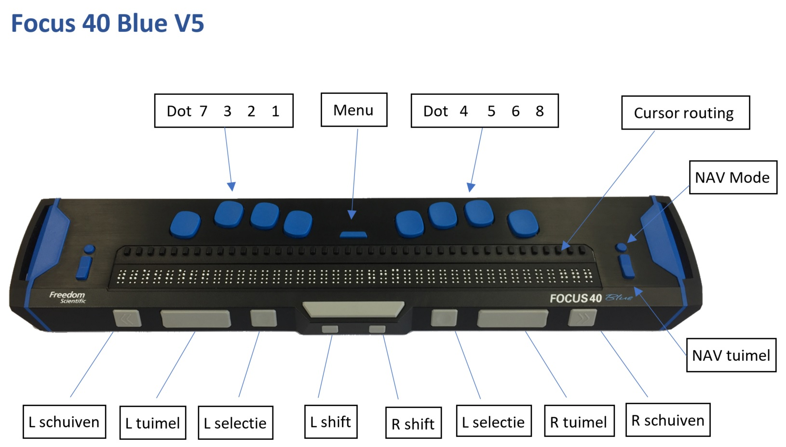

# voiceOver en Braille
* [apple voice over](https://support.apple.com/en-gb/guide/iphone/iph3e2e2281/ios)

- drie vingers - 1 tik - sporaak/aan en uit

<!--

-->

* [toetsen/apple](https://support.apple.com/nl-nl/103722)
* [freedom scientific](https://www.freedomscientific.com/training/braille/focus/focus-user-guide/)

### Linkerkant
On the left side of the display, going from front to back, you will find a Micro SD slot which contains a Micro SD card, the Power button, and a micro USB-C port. The USB port allows you to connect the display to a computer using the supplied USB cable, or to the AC adapter.

### Braille-cellen
The refreshable **braille cells** are located toward the front of the unit. A refreshable display creates braille by electronically raising and lowering different combinations of pins in each braille cell.

### Cursor router buttons
Above each braille cell is a **Cursor Router button** used for moving quickly to that location.

### Nav Rockers
At each end of the display’s surface are **NAV Rockers** used for easy navigation. Positioned above each NAV Rocker is a NAV Mode button which cycles through the different navigation modes.

### Braille keyboard
Positioned directly above the Cursor Router buttons, there are eight keys similar to those on a Perkins-style braille keyboard. These keys are used to enter text or perform commands.  
Between dots 1 and 4 is a Menu button which is used to access the Focus configuration menu as well as display Focus status information during an active connection.   
On the front edge, directly under and in the center of the display is a SPACEBAR. This key is used together with the braille keys when entering commands. A command that includes the SPACEBAR is commonly referred to as a chorded command.   
For example, L CHORD or DOTS 1-2-3 CHORD, press DOTS 1-2-3 with the SPACEBAR at the same time.

### Panning, Rocker, Selector, Shift button
On the front edge of the display are the following controls, located from left to right. The layout of these controls is slightly different depending on what model of Focus you have.

|**Navigatie**|**Functie in VoiceOver**|
|---|---|
|Toets brailleleesregel| |
|Ga naar vorig onderdeel|Right Nav Rocker Up, Rechter navigatie tuimeltoets omhoog|
|Ga naar volgend onderdeel|Right Nav Rocker Down|
|Scrol één pagina naar links|Right Rocker Up, Rechter tuimeltoets omhoog|
|Scrol één pagina naar rechts|Right Rocker Down|
|Scrol één pagina omhoog|Left Rocker Up|
|Scrol één pagina omlaag|Left Rocker Down|
|Activeer de knop 'Vorige', indien aanwezig|Left Selector|
  
    
|**Rotor**|**Functie in VoiceOver**|
|---|---|
|Toets brailleleesregel| |
|Ga naar vorig onderdeel met rotorinstelling|Left Nav Rocker Up|
|Ga naar volgend onderdeel met rotorinstelling|Left Nav Rocker Down|
  
    
|**Interactie**|**Functie in VoiceOver**|
|---|---|
|Toets brailleleesregel| |
|Tik dubbel op het geselecteerde onderdeel|Router Row|
|Selecteer onderdeel onder uw vinger|Left Mode Button of Right Mode Button|
|De huidige locatie starten of onderbreken|Right Selector|
  
   

|**Braille**|**Functie in VoiceOver**|
|---|---|
|Toets brailleleesregel| |
|Schakel uitgebreide statusbeschrijving in of uit|Status Router Row|
|Verschuif brailleleesregel naar links|Left Panning|
|Verschuif brailleleesregel naar rechts|Right Panning|

